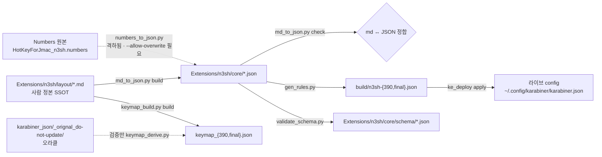

# 목적

`Extensions/n3sh/core/` 의 JSON 파일 각각이 **무엇이고, 어떤 컬럼을 갖고, 누가 만들고 누가 읽는지**를 사람이 읽을 수 있는 형태로 모아 둔다. JSON 배열만 놓고는 규칙 250여 건을 검토할 수 없어서 데이터 결함이 도구가 깨진 뒤에야 발견되던 문제를 앞단에서 막는 것이 목적이다.

> 📦 **여기 있는 것은 전부 도구가 읽는 md 다** (2026-08-08). n3sh 폴더는 **역할 3분할**이다 —
> `layout/`(입력·사람 정본) · [core/](../core)(출력·생성 JSON) · [_doc/](../_doc)(문서·어떤 도구도 열지 않는다).
> 판정 한 줄: **프로그램이 이 파일을 여는가.** 열면 `layout/`, 안 열면 `_doc/`.
> 규칙 서술(`rules_notes*`)·표기 SSOT(`notation.md`)·`CHANGELOG.md` 는 [_doc/README.md](../_doc/README.md) 가 색인한다.

# 문서 목록

사람이 실제로 손대는 단위에 맞춰 **3그룹**으로 묶었다. 그룹이 곧 편집 맥락이다.

## 1. 규칙 — 실제로 동작하는 것

| 문서                                                       | 대응 데이터                                                                                                                                       | 내용                                                       |        건수 |
| :--------------------------------------------------------- | :------------------------------------------------------------------------------------------------------------------------------------------------ | :--------------------------------------------------------- | ----------: |
| [n390/rules.md](n390/rules.md)                 | [rules.json](../core/n390/rules.json)                                                                                                           | **390 판 완전 정본** (254행 — Intersection 방식)           |         254 |
| [final/rules.md](final/rules.md)               | [rules.json](../core/final/rules.json)                                                                                                          | **최종식 판 완전 정본·keymap 학습 소스** (229행)           |         229 |
| [rules_Intersection.md](rules_Intersection.md) | — (파생 뷰 — `make_intersection.py` 산출)                                                                                                         | 양 배열 교집합 212행 — 직접 편집 금지                      |         212 |
| [keymap.md](keymap.md)                         | [keymap_390](../core/keymap_390.json) · [keymap_final](../core/keymap_final.json) · [keymap_final_to_390](../core/keymap_final_to_390.json) | 심볼 → 키열 매핑과 배열 간 차이 9건                        | 81 / 82 / 9 |
| `data/devices.md`                              | `data/devices.json`                                                                                                            | `device_if` 물리 장치(vendor/product) 정본과 연결 상태     |           2 |

## 2. 작업 대기 — 아직 규칙이 아닌 것

| 문서                                             | 대응 데이터                                  | 분류                                                         | 건수 |
| :----------------------------------------------- | :------------------------------------------- | :----------------------------------------------------------- | ---: |
| [n390/staging.md](n390/staging.md)   | [staging.json](../core/n390/staging.json)  | 390 작업 대기 — `job` 단일표(미정 38 · 수정 2)               |   40 |
| [final/staging.md](final/staging.md) | [staging.json](../core/final/staging.json) | 최종식 작업 대기 — `job` 단일표. 최종식 판정 미시작           |   20 |
| [n390/rules_prohibit.md](n390/rules_prohibit.md)   | [prohibit.json](../core/n390/prohibit.json)  | 390 배정 금지 자리 SSOT — 사유 필수                          |    6 |
| [final/rules_prohibit.md](final/rules_prohibit.md) | [prohibit.json](../core/final/prohibit.json) | 최종식 배정 금지 자리 SSOT — 사유 필수                       |    3 |

5분류가 각각 절(H1)로 분리돼 있어, 분류별로 표를 그대로 읽고 고칠 수 있다.

## 3. 훈련·부속 — 동작과 무관한 것

**두 계열로 나뉜다.** 규칙 쪽(`rules*.md`)이 **설계 계열**, `training*.md` 가 **매뉴얼 계열 초안**이다. [rules_step.md](n390/rules_step.md) 는 오래 학습자 진입점처럼 쓰였으나 설계 문서다(2026-08-05 재규정).

⚠️ **매뉴얼 계열은 전부 초안이다 — 프로모션 전이라 완성도보다 갱신 속도를 택한다.** 형식을 다듬느라 규칙 반영이 늦어지지 않게 한다. 프로모션 후에는 **버전을 붙여 별도 폴더**로 옮길 예정이므로, 지금 여기서는 내용 정합만 맞으면 된다(`validate_docs.py` 가 그 정합을 본다).

| 문서                                                                     | 계열                | 성격                                                   |
| :------------------------------------------------------------------------ | :------------------ | :------------------------------------------------------ |
| [n390/training.md](../_doc/n390/training.md)                         | 📝 **매뉴얼 초안**  | 단계별 드릴·연습 문장 — 배우는 사람의 진입점           |
| [n390/training_cheatsheet.md](../_doc/n390/training_cheatsheet.md)   | 📝 **매뉴얼 초안**  | 치트시트 — 매뉴얼과 짝인 한 장 요약                    |
| [n390/rules_step.md](n390/rules_step.md)                     | 📐 설계             | 단계 정의·배정 근거·건수 SSOT (`rules.md` 와 한 묶음)  |
| `_doc_base/training_for_nowage.md`                        | 🙋 개인 전용        | 전환기 자료 — 재배치 이전 손버릇 교정. 범용 아님. **`_doc_base/` 로 나갔다** |

| 문서                                                       | 대응 데이터                                                                                         | 내용                                                                                 |   건수 |
| :--------------------------------------------------------- | :-------------------------------------------------------------------------------------------------- | :----------------------------------------------------------------------------------- | -----: |
| [final/training.md](../_doc/final/training.md)         | [practice.json](../core/final/practice.json) · [memory_aid.json](../core/final/memory_aid.json) | 최종식 1·2열 연습 + 암기용 발췌 (Numbers 원본 유래. 390 훈련은 `n390/training.md`)   | 4 / 15 |
| [fsnippet-한글속기.md](../_doc/n390/fsnippet-한글속기.md) | [fsnippet_snippets.json](../core/fsnippet_snippets.json)                                          | fSnippet(prj9) `_한글속기` 스니펫 세트 — 두 글자 이상 축약 담당  |    126 |

## 4. 배열별 계층

배열마다 `n390/`·`final/` 하위에 규칙표와 **버전 단위**(`VERSION`)를 함께 둔다. 그 배열의 변경 이력(`CHANGELOG.md`)만은 도구가 읽지 않으므로 [_doc/](../_doc) 의 같은 이름 하위 폴더에 있다.

# 링크 = 생성·설명 방향

| 관계 | md frontmatter     | JSON 최상위     | 해당                                                                                 |
| :--- | :----------------- | :-------------- | :----------------------------------------------------------------------------------- |
| 생성 | `generates: [...]` | `source: "..."` | rules(배열별) · staging(배열별) · practice · memory_aid · fsnippet_snippets          |
| 설명 | `documents: [...]` | `doc: "..."`    | `keymap_final_to_390`(배열 차이 SSOT — 손 관리) · devices (정수 값이라 md 셀 왕복 규약 밖 — 손 관리) |

대응하는 파일끼리만 연결하며, 두 링크는 서로를 가리킨다. 규약은 `.claude/rules/data-md-first-rules.md` "링크 = 생성·설명 방향".

# 데이터 흐름



# 데이터를 고치는 방법 (2026-07-26 P2 완료)

**md 가 SSOT 다.** 표를 고치고 생성기를 돌린다.

```bash
python3 tools/md_to_json.py build      # md → Extensions/n3sh/core/*.json 재생성
python3 tools/md_to_json.py check      # 정합 확인 (exit 0 이어야 함)
python3 tools/validate_schema.py       # 스키마 검증
python3 tools/gen_rules.py             # 규칙 데이터면 오라클 대조까지
```

* `Extensions/n3sh/core/*.json` **직접 편집 금지** — 생성 산출물이다.
* 셀 표기: `—` = 빈 문자열, `␣` = 공백 1칸. 앞뒤 공백이 값의 일부인 항목이 있어(ex: `txt` `"고 "`) 이 표기로 보존한다.
* `rules`·`staging` 의 `c1`·`c2`(누르는 키) 컬럼에서 `␣` 는 **스페이스바 키**를 뜻하고 JSON 에는 `_` 로 저장된다. 같은 행 `txt` 의 `␣` 는 출력 공백이니, 뜻을 가르는 것은 컬럼이다.
    - 예외: [final/training.md](../_doc/final/training.md) 의 `memory_aid` 는 `c1`/`c2` 값이 패딩 공백을 포함한 키 문자열(`␣␣h␣`)이라 스페이스바를 `_` 그대로 적는다.
    - ⚠️ `sync-md` 는 **모든 절의 `idx` 를 0-based 전역 번호로 덮어쓰고 표 서식도 자체 렌더러로 다시 짠다**(2026-08-05 실측 — `rules.md`·`rules_step.md` 까지 전면 재렌더). (n390 staging 은 2026-08-05 `job` 단일표로 바뀌며 `idx` 컬럼 자체를 뺐다 — 구 `{계열}-{순번}` 수기 체계는 폐지.) 표기만 고칠 때는 `sync-md` 대신 해당 셀을 직접 편집할 것. `build`·`check` 는 `idx` 를 잘라 버리므로 안전하다.
* 도구가 JSON 을 먼저 바꿔 버린 경우엔 `md_to_json.py sync-md` 로 md 를 되맞춘다.
* `keymap_{390,final}` 은 **`keymap.md` 가 정본**이지만 심볼 shape 이 2종이라 `md_to_json` 의 `Spec` 모델 밖이다 — 전용 도구 `keymap_build.py build`·`check` 가 담당하고 `md_to_json` 은 사유와 함께 `SKIP` 한다. `keymap_final_to_390` 은 손 관리 SSOT.

# 관련

* 설계 SSOT: `_doc_arch/data-pipeline-design.md`
* 계획: `_doc_work/z_done/plan/md-first-data_plan.md`
* 스키마: [Extensions/n3sh/core/schema/](../core/schema)